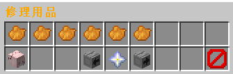

# 怎么使用修理包

你不能在安全区（大厅）使用修理包，如果你想要在安全区（大厅）修理物品，请使用[修复装备](xin-shou-kuai-su-shang-shou/you-xi-liu-cheng/xiu-fu-shou-sun-de-zhuang-bei.md)功能

在对局内，你需要使用修理包来回复你想要修复的受损物品

<figure><figcaption>
<a href="xin-shou-kuai-su-shang-shou/you-xi-liu-cheng/zhan-qian-zhun-bei/xi-tong-shang-dian.md">商店</a> -> 消耗品 -> 第6页
</figcaption></figure>

\

不同的修理包的属性不一样，怎么查看属性信息请参考[鉴定物品](xin-shou-kuai-su-shang-shou/zen-me-jian-ding-wu-pin.md)

修理包的属性：

* 维修等级：修理包的修理等级必须大于或等于目标物品的等级
* 启用时间：在开始回复物品耐久度前的预备时间
* 单次修理量：每次回复耐久度回复多少耐久
* 耐用度：可用次数，每回一次耐久度扣一次
* 估价：在系统商店出售此修理包能赚多少钱

<figure><figcaption>
简易修理袋的属性信息
</figcaption></figure>

修理包的使用条件：

* 玩家必须主手持有修理包，副手持有需要修理的物品。
* 玩家必须保持蹲下状态。
* 左键键点击开始使用修理包。
* 目标物品必须有保护等级或穿透等级，且修理包的修理等级必须大于或等于目标物品的等级。

<figure><figcaption>
保持蹲下状态，主手持有修理包，副手持有需要修理的物品
</figcaption></figure>

修理过程：\
修理过程在启用时间后开始。\
每2秒回复一次耐久度，直到修理包的可用次数耗尽或目标物品耐久度满。\
修理过程中会播放音效，并在动作栏显示修理进度。

提示信息\
修理开始时提示等待时间。\
每次修理成功后提示已修理的耐久度和剩余次数。\
修理停止时根据原因播放不同音效并提示信息。

终止条件\
前置条件被违反（如玩家不再蹲下，或主手/副手物品改变）。\
可用次数为0，修理包被消耗。\
目标物品耐久度已满。
